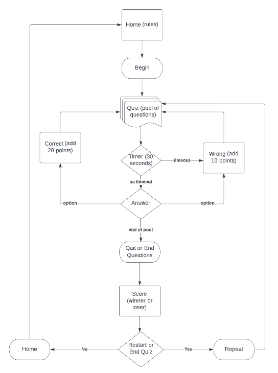

## Table of Contents
* [Purpose](#Purpose)
* [Features](#Features)
    * [Existing](#Existing)
        * [Main](#Main-Page)
        * [Quiz](#Quiz)
        * [Score](#Score)
    * [Left to Implement](#Left-to-Implement)
* [Technologies](#Technologies)
* [User Experience Design (UX)](#User-Experience-Design)
    * [Structure](#Structure)
    * [Business Goals](#Business-Goals)
    * [User Goals](#User-Goals)
        * [First Time Visitor](#First-Time-Visitor)
        * [Returning Visitor](#Returning-Visitor)
        * [Frequent User](#Frequent-User)
    * [Design](#Design)
        * [Colour Scheme](#Colour-Scheme)
        * [Typography](#Typography)
        * [Wireframes](#Wireframes)
* [Limitations](#Limitations)
* [Testing](#Testing)
    * [Test Results](#Test-Results)
        * [Validators](#Validators)
        * [Lighthouse](#Lighthouse)
        * [W3 Validator](#W3-Validator)
        * [CSS Validator](#CSS-Validator)
        * [JShint](#JShint)
    * [Testing Issues](#Testing-Issues)
* [Deployment](#Deployment)
    * [Project Creation](#Project-Creation)
    * [GitHub Pages](#Github-Pages)
    * [Locally](Locally)
    * [Commands](Commands)
* [Credits](#Credits)
    * [Content](#Content)
    * [Media](#Media)
    * [Acknowledgements](#Acknowledgements)

## Purpose
The idea behind this site is to allow players to to validate their knowledge on movies or songs. The pool of questions is limited but can be incremented in future releases and the rules may change to increase complexity.

The live website can be found [here](https://baptistapaulo.github.io/pp2/).

[Table-of-Contents](#Table-of-Contents)

## Features
### Existing
#### Main-Section

#### Quiz

#### Score

### Left-to-Implement
This website has a few limitations as some errors were found while deploying JavaScript functions and DOM. These have not been fixed yet but are planned for the new release.
- adaptative quiz where the questions can be o any type (movie or song) but the type must change after a sequence of two with same type
- username requested at the beginning for the player name
- different levels of difficulty

[Table-of-Contents](#Table-of-Contents)

## Technologies
* Languages
    * HTML5
    * CSS3
    * JavaScript
* Frameworks, Libraries and Programs
    * Google fonts
    * Font Awesome
    * GitHub (used to store repositories, files and images pushed from GitPod)
    * GitPod (IDE used to code the website)
    * Git (for version control, commits and push to GitHub)
    * Google Chrome Developer Tools (for checking compatibility, troubleshooting and editing code)
    * TinyPNG (for compression of your WEBP, JPEG and PNG files) [here](https://tinypng.com/)
    * Favicon (used to create favicon) [here](https://www.favicon.io/)
    * Stackoverflow (for searching on some topics related to HTML/CSS)
    * W3schools (for HTML/CSS tutorials)
    * Lucidchart (used to create flowchart for JS) [here](https://www.lucidchart.com/)

[Table-of-Contents](#Table-of-Contents)

## User-Experience-Design
The UX was deployed and tested for different screen sizes.

### Structure

[Table-of-Contents](#Table-of-Contents)

### Business-Goals
* Provide a game for entertainment.
* Allow users to test their knowledge about artists.
* Create a ranking of users based on score to promote competition.
* Increase quiz DB with levels of difficulty for the pool of questions.
### User-Goals
#### First-Time-Visitor
* Easy navigation and search for information.
* Site should be visually appealing.
#### Returning-Visitor
* Curiosity about questions.
* Testing knowledge.
#### Frequent-User
* Challenge with new pool of questions.
* Get better score.
### Design
#### Colour-Scheme
* Predominant colours across all site are red (gradient) and yellow.
* Black and white ocasionaly.
#### Typography
**Times New Roman** (Times, serif) was used in all sections.
#### Wireframes

[Table-of-Contents](#Table-of-Contents)

## Limitations
This website has a few limitations as some errors were found while deploying JavaScript functions and DOM. These have not been fixed yet but are planned for the new release.
- pool of questions should be limited to 5 and finish the quiz but this is only working with the timer
- each question should be limited to 30 seconds but at this moment that is for the whole pool of questions
- the pool of questions is not yet deployed with JSON

[Table-of-Contents](#Table-of-Contents)

## Testing
### Test-Results
#### Validators
* HTML - Official W3C validator [here](https://validator.w3.org/).
* CSS - Official (Jigsaw) validator [here](https://jigsaw.w3.org/css-validator/).
* JSHint - Official (JSHint) validator [here](https://jshint.com/).
* WAVE - Web Accessibility Evaluation Tool [here](https://wave.webaim.org/).
* Lighthouse – Developer Tools
* Chrome – Developer Tools
* Am I Responsive [here](https://ui.dev/amiresponsive).

#### Lighthouse

#### W3 Validator
No errors found (only warnings in the quiz page).

#### CSS Validator
No errors found.

#### JShint
No errors found.

#### Devices
Tested functionality and responsiveness using the below devices and browsers.
* Mobiles
    * Samsung S9
    * Samsung Note
    * Samsung A51
* Laptops
    * HP EliteBook
    * Lenovo ThinkPad
* Browsers
    * Chrome
    * Firefox
    * Edge

### Testing-Issues
* Bugs identified that need to be fixed.
    * pool count does not stop at 5.
    * timer is not per question.
    * the results logo (winner|loser) not changing dynamically.

[Table-of-Contents](#Table-of-Contents)

## Deployment
### Project-Creation
This project website was created from scratch, with no forking from any other repositories but based on the initial structure of the Code Institute walkthrough.
Once the structure was in place, then added content and styling as the work was in progress. Some styling was gathered from **Stackoverflow** or **W3schools**.
#### Github-Pages
Repository
1. Navigate to the GitHub [Repository:](https://github.com/baptistapaulo/pp1)
1. Click the 'Settings' Tab.
1. Scroll Down to the Git Hub Pages Heading.
1. Select 'Master Branch' as the source.
1. Click the Save button.
1. Click on the link to go to the live deployed page.
### Locally
Clone
1. Navigate to the GitHub [Repository:](https://github.com/baptistapaulo/pp1)
1. Click the Code drop down menu.
1. Either Download the ZIP file, unpackage locally and open with IDE (This route ends here) OR Copy Git URL from the HTTPS dialogue box.
1. Open your developement editor of choice and open a terminal window in a directory of your choice.
1. Use the 'git clone' command in terminal followed by the copied git URL.
1. A clone of the project will be created locally on your machine.
### Fork
Most commonly, forks are used to either propose changes to someone else's project to which you do not have write access, or to use someone else's project as a starting point for your own idea. You can fork a repository to create a copy of the repository and make changes without affecting the upstream repository.
So a fork is a copy of a repository. Forking a repository allows you to freely experiment with changes without affecting the original project.
1. Navigate to the GitHub Repository you want to fork.
1. On the top right of the page under the header, click the fork button.
1. Create a new fork.
1. This will create a duplicate of the full project in your GitHub Repository.
### Commands
* `CTRL + S` was used to save the page.
* `CTRL + Z` was used to undo a change.
* `python3 -m http.server` was used to view and test site before pushing live.
* `git add` was used to add pages to the stage area.
* `git commit -m "fix: message here"` was used to comit them them to github and provide a relevant message to the changes that had been made.
* `git push` was used to push the changes upto Github for public viewing.

[Table-of-Contents](#Table-of-Contents)

## Credits
### Content
* [Code Institute](https://codeinstitute.net/ie/) course material, mainly the "Love Maths" Walkthrough.
* [MDN Web Docs](https://developer.mozilla.org/en-US/docs/Learn)
* [W3Schools](https://www.w3schools.com/jsref/default.asp)
* [StackOverflow](https://stackoverflow.com/questions)

### Media
* The photos used in this website were taken from some resources such as the below.
    * [Pexels](https://www.pexels.com/) - used for images
    * [Unsplash](https://unsplash.com/) - used for images
    * [Google](https://www.google.com/)- used for images

### Acknowledgements
* Huge thank you to my mentor **Ronan McClelland** for his guidance throughout my project.
* Some inspiration was found on this site [here](https://github.com/michaelrfreitas/p2_web_curiosity-quiz) so credits to its Author.

[Table-of-Contents](#Table-of-Contents)